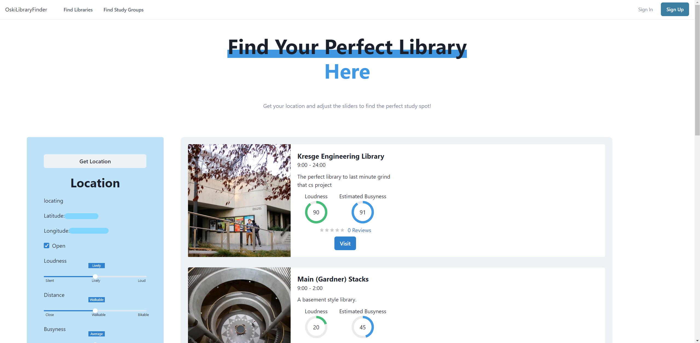
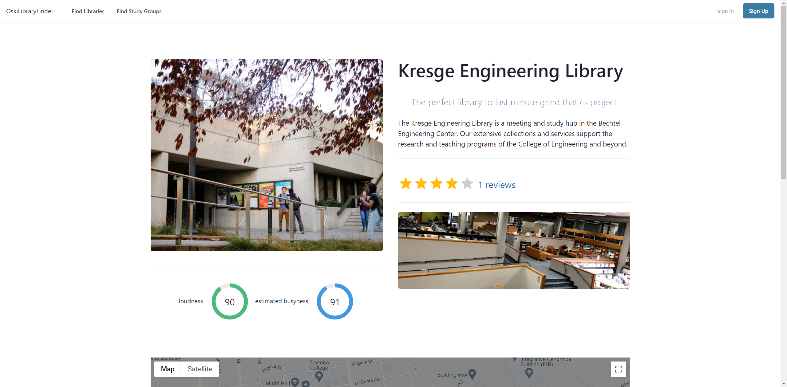
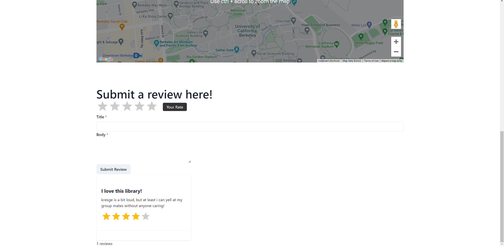

Made by Curtis, Henley, Jacob, Alvie, Aaron


<!-- ABOUT THE PROJECT -->
## About

### Project Idea
 An online platform that collects information about libraries across the UC Berkeley campus and recommends the user a selection of choices based on user preference input. Accessible information about libraries which the “filter by” feature will be based upon includes a live crowd meter, user reviews, open hours, and more. 

### Motivation: 
For any given day, students generally struggle to choose a library to study in that is not crowded, open, or relatively close to where they are currently standing. The pursuit of our project idea will serve as a handy tool to help students find the most optimal library on campus based on their personal preferences, in addition to facilitating study group formations.


### Built With:
React.js, Axios, Chakra UI, MongoDB, Express.js, Node.js


## Getting Started


### Prerequisites

  This project requires an installation of npm and MongoDB. 


### Installation


1. Start the backend
   ```sh
   cd backend
   npm start
   ```
2. Start the frontend
   ```sh
   cd frontend
   npm i
   npm start
   ```


### Features
- Algorithm thats generate an ordered list that tries to align with user inputed preferences
- Dynamic router for procedural website per library
- API to gather live/estimated busyness at a library
- Caching system to limit API calls
- Authentication and login system to save user preferences
- Review and rating system per library
- Libraries are not hard coded, easy to add additional places. 

### Screenshots

##

##



Thank you Jacob, Alvie, Aaron, and Curtis! 
It was a pleasure working with you all. 
